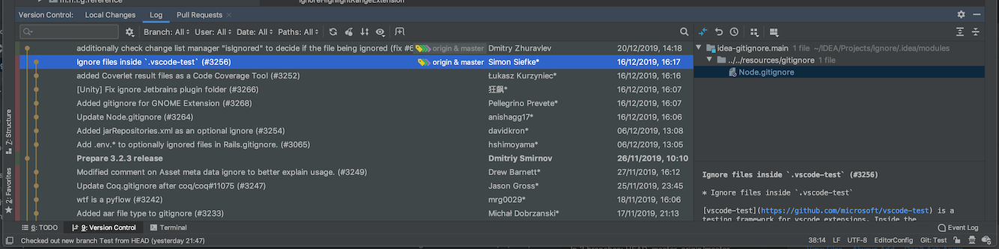

# Git in IntelliJ / PyCharm / WebStorm / PhpStorm / RubyMine

JetBrains IDEs (such as IntelliJ IDEA, PyCharm, WebStorm, PhpStorm, RubyMine, and others) ship with a Git Integration plugin.
It provides a dedicated view in the IDE to work with Git and GitHub Pull Requests.

<figure class="image">

<figcaption>Figure 10. Version Control ToolWindow in JetBrains IDEs.</figcaption>
</figure>

The integration relies on the command-line git client, and requires one to be installed.
The official documentation is available at <a href="https://www.jetbrains.com/help/idea/using-git-integration.html" class="link">https://www.jetbrains.com/help/idea/using-git-integration.html</a>.

