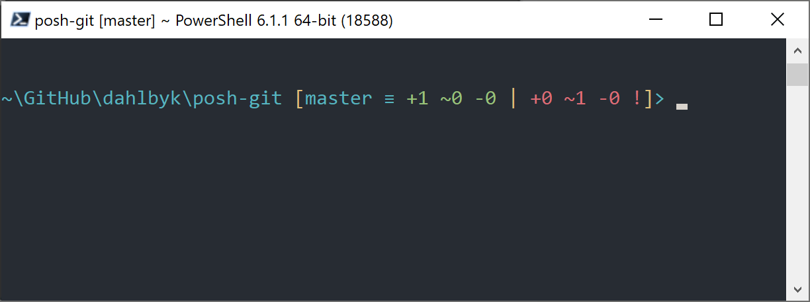

# Git 在 PowerShell 中使用 Git

Windows 中早期的命令行终端 <code class="literal">cmd.exe</code> 无法自定义 Git 使用体验，但是如果你正在使用 Powershell，那么你就十分幸运了。
这种方法同样适用于 Linux 或 macOS 上运行的 PowerShell Core。
一个名为 Posh-Git (<a href="https://github.com/dahlbyk/posh-git" class="link">https://github.com/dahlbyk/posh-git</a>) 的扩展包提供了强大的 tab 补全功能， 并针对提示符进行了增强，以帮助你聚焦于你的仓库状态。
它看起来像：

<figure class="image">

<figcaption>Figure 14. 附带了 Posh-Git 扩展包的 Powershell。</figcaption>
</figure>

## 安装

### 前提需求（仅限 Windows）

在可以运行 PowerShell 脚本之前，你需要将本地的 ExecutionPolicy 设置为 RemoteSigned
（可以说是允许除了 Undefined 和 Restricted 之外的任何内容）。如果你选择了 AllSigned
而非 RemoteSigned，那么你的本地脚本还需要数字签名后才能执行。如果设置为 RemoteSigned，
那么只有“ZoneIdentifier”设置为 Internet，即从 Web 上下载的脚本才需要签名，其它则不需要。
如果你是管理员，想要为本机上的所有用户设置它，请使用“-Scope LocalMachine”。
如果你是没有管理权限的普通用户，可使用“-Scope CurrentUser”来只为自己设置它。

有关 PowerShell Scopes 的更多详情： <a href="https://docs.microsoft.com/en-us/powershell/module/microsoft.powershell.core/about/about_scopes" class="link">https://docs.microsoft.com/en-us/powershell/module/microsoft.powershell.core/about/about_scopes</a>

有关 PowerShell ExecutionPolicy 的更多详情： <a href="https://docs.microsoft.com/en-us/powershell/module/microsoft.powershell.security/set-executionpolicy" class="link">https://docs.microsoft.com/en-us/powershell/module/microsoft.powershell.security/set-executionpolicy</a>

<pre class="source language-powershell"><code>&gt; Set-ExecutionPolicy -Scope LocalMachine -ExecutionPolicy RemoteSigned -Force</code></pre>

### PowerShell Gallery

如果你有 PowerShell 5 以上或安装了 PackageManagement 的 PowerShell 4，那么可以用包管理器来安装 posh-git。

有关 PowerShell Gallery 的更多详情： <a href="https://docs.microsoft.com/en-us/powershell/gallery/overview" class="link">https://docs.microsoft.com/en-us/powershell/gallery/overview</a>

<pre class="source language-powershell"><code>&gt; Install-Module posh-git -Scope CurrentUser -Force
&gt; Install-Module posh-git -Scope CurrentUser -AllowPrerelease -Force # 带有 PowerShell Core 支持的更新的 beta 版</code></pre>

如果你想为所有的用户安装 posh-git，请使用“-Scope AllUsers”并在管理员权限启动的 PowerShell 控制台中执行。
如果第二条命令执行失败并出现类似 <code class="literal">Module 'PowerShellGet' was not installed by using Install-Module</code> 这样的错误，
那么你需要先运行另一条命令：

<pre class="source language-powershell"><code>&gt; Install-Module PowerShellGet -Force -SkipPublisherCheck</code></pre>

之后你可以再试一遍。出现这个错误的原因是 Windows PowerShell 搭载的模块是以不同的发布证书签名的。

### 更新 PowerShell 提示符

要在你的提示符中包含 Git 信息，那么需要导入 Posh-Git 模块。
要让 PowerShell 在每次启动时都导入 Posh-Git，请执行 Add-PoshGitToProfile 命令，
它会在你的 $profile 脚本中添加导入语句。此脚本会在每次打开新的 PowerShell 终端时执行。
注意，存在多个 $profile 脚本。例如，其中一个是控制台的，另一个则属于 ISE。

<pre class="source language-powershell"><code>&gt; Import-Module posh-git
&gt; Add-PoshGitToProfile -AllHosts</code></pre>

### 从源码安装

只需从 (<a href="https://github.com/dahlbyk/posh-git" class="link">https://github.com/dahlbyk/posh-git</a>) 下载一份 Posh-Git 的发行版并解压即可。
接着使用 posh-git.psd1 文件的完整路径导入此模块：

<pre class="source language-powershell"><code>&gt; Import-Module &lt;path-to-uncompress-folder&gt;\src\posh-git.psd1
&gt; Add-PoshGitToProfile -AllHosts</code></pre>

它将会向你的 <code class="literal">profile.ps1</code> 文件添加适当的内容，Posh-Git 将会在下次打开 PowerShell 时启用。
命令提示符显示的 Git 状态信息的解释见： <a href="https://github.com/dahlbyk/posh-git/blob/master/README.md#git-status-summary-information" class="link">https://github.com/dahlbyk/posh-git/blob/master/README.md#git-status-summary-information</a>
如何定制 Posh-Git 提示符的详情见： <a href="https://github.com/dahlbyk/posh-git/blob/master/README.md#customization-variables" class="link">https://github.com/dahlbyk/posh-git/blob/master/README.md#customization-variables</a>

