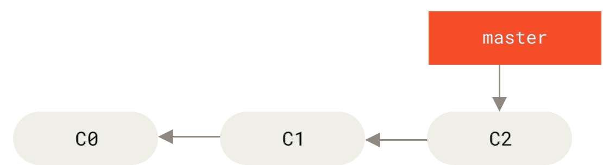

# 分支的新建与合并

让我们来看一个简单的分支新建与分支合并的例子，实际工作中你可能会用到类似的工作流。
你将经历如下步骤：

<ol class="arabic">
<li>
开发某个网站。
</li>
<li>
为实现某个新的用户需求，创建一个分支。
</li>
<li>
在这个分支上开展工作。
</li>
</ol>

正在此时，你突然接到一个电话说有个很严重的问题需要紧急修补。
你将按照如下方式来处理：

<ol class="arabic">
<li>
切换到你的线上分支（production branch）。
</li>
<li>
为这个紧急任务新建一个分支，并在其中修复它。
</li>
<li>
在测试通过之后，切换回线上分支，然后合并这个修补分支，最后将改动推送到线上分支。
</li>
<li>
切换回你最初工作的分支上，继续工作。
</li>
</ol>

## 新建分支

首先，我们假设你正在你的项目上工作，并且在 <code class="literal">master</code> 分支上已经有了一些提交。

<figure class="image">

<figcaption>Figure 10. 一个简单提交历史</figcaption>
</figure>

现在，你已经决定要解决你的公司使用的问题追踪系统中的 #53 问题。
想要新建一个分支并同时切换到那个分支上，你可以运行一个带有 <code class="literal">-b</code> 参数的 <code class="literal">git checkout</code> 命令：

<pre class="language-bash"><code>$ git checkout -b iss53
Switched to a new branch &quot;iss53&quot;</code></pre>

它是下面两条命令的简写：

<pre class="language-bash"><code>$ git branch iss53
$ git checkout iss53</code></pre>
<figure class="image">

<figcaption>Figure 11. 创建一个新分支指针</figcaption>
</figure>

你继续在 #53 问题上工作，并且做了一些提交。
在此过程中，<code class="literal">iss53</code> 分支在不断的向前推进，因为你已经检出到该分支
（也就是说，你的 <code class="literal">HEAD</code> 指针指向了 <code class="literal">iss53</code> 分支）

<pre class="language-bash"><code>$ vim index.html
$ git commit -a -m &#39;added a new footer [issue 53]&#39;</code></pre>
<figure class="image">

<figcaption>Figure 12. <code class="literal">iss53</code> 分支随着工作的进展向前推进</figcaption>
</figure>

现在你接到那个电话，有个紧急问题等待你来解决。
有了 Git 的帮助，你不必把这个紧急问题和 <code class="literal">iss53</code> 的修改混在一起，
你也不需要花大力气来还原关于 53# 问题的修改，然后再添加关于这个紧急问题的修改，最后将这个修改提交到线上分支。
你所要做的仅仅是切换回 <code class="literal">master</code> 分支。

但是，在你这么做之前，要留意你的工作目录和暂存区里那些还没有被提交的修改，
它可能会和你即将检出的分支产生冲突从而阻止 Git 切换到该分支。
最好的方法是，在你切换分支之前，保持好一个干净的状态。
有一些方法可以绕过这个问题（即，暂存（stashing） 和 修补提交（commit amending）），
我们会在 <a id="xref--ch07-git-tools--_git_stashing" href="/chapter-7/3.html#贮藏与清理" class="xref">贮藏与清理</a> 中看到关于这两个命令的介绍。
现在，我们假设你已经把你的修改全部提交了，这时你可以切换回 <code class="literal">master</code> 分支了：

<pre class="language-bash"><code>$ git checkout master
Switched to branch &#39;master&#39;</code></pre>

这个时候，你的工作目录和你在开始 #53 问题之前一模一样，现在你可以专心修复紧急问题了。
请牢记：当你切换分支的时候，Git 会重置你的工作目录，使其看起来像回到了你在那个分支上最后一次提交的样子。
Git 会自动添加、删除、修改文件以确保此时你的工作目录和这个分支最后一次提交时的样子一模一样。

接下来，你要修复这个紧急问题。
我们来建立一个 <code class="literal">hotfix</code> 分支，在该分支上工作直到问题解决：

<pre class="language-bash"><code>$ git checkout -b hotfix
Switched to a new branch &#39;hotfix&#39;
$ vim index.html
$ git commit -a -m &#39;fixed the broken email address&#39;
[hotfix 1fb7853] fixed the broken email address
 1 file changed, 2 insertions(+)</code></pre>
<figure class="image">

<figcaption>Figure 13. 基于 <code class="literal">master</code> 分支的紧急问题分支 <code class="literal">hotfix branch</code></figcaption>
</figure>

你可以运行你的测试，确保你的修改是正确的，然后将 <code class="literal">hotfix</code> 分支合并回你的 <code class="literal">master</code> 分支来部署到线上。
你可以使用 <code class="literal">git merge</code> 命令来达到上述目的：

<pre class="language-bash"><code>$ git checkout master
$ git merge hotfix
Updating f42c576..3a0874c
Fast-forward
 index.html | 2 ++
 1 file changed, 2 insertions(+)</code></pre>

在合并的时候，你应该注意到了“快进（fast-forward）”这个词。
由于你想要合并的分支 <code class="literal">hotfix</code> 所指向的提交 <code class="literal">C4</code> 是你所在的提交 <code class="literal">C2</code> 的直接后继，
因此 Git 会直接将指针向前移动。换句话说，当你试图合并两个分支时，
如果顺着一个分支走下去能够到达另一个分支，那么 Git 在合并两者的时候，
只会简单的将指针向前推进（指针右移），因为这种情况下的合并操作没有需要解决的分歧——这就叫做 “快进（fast-forward）”。

现在，最新的修改已经在 <code class="literal">master</code> 分支所指向的提交快照中，你可以着手发布该修复了。

<figure class="image">

<figcaption>Figure 14. <code class="literal">master</code> 被快进到 <code class="literal">hotfix</code></figcaption>
</figure>

关于这个紧急问题的解决方案发布之后，你准备回到被打断之前时的工作中。
然而，你应该先删除 <code class="literal">hotfix</code> 分支，因为你已经不再需要它了 —— <code class="literal">master</code> 分支已经指向了同一个位置。
你可以使用带 <code class="literal">-d</code> 选项的 <code class="literal">git branch</code> 命令来删除分支：

<pre class="language-bash"><code>$ git branch -d hotfix
Deleted branch hotfix (3a0874c).</code></pre>

现在你可以切换回你正在工作的分支继续你的工作，也就是针对 #53 问题的那个分支（iss53 分支）。

<pre class="language-bash"><code>$ git checkout iss53
Switched to branch &quot;iss53&quot;
$ vim index.html
$ git commit -a -m &#39;finished the new footer [issue 53]&#39;
[iss53 ad82d7a] finished the new footer [issue 53]
1 file changed, 1 insertion(+)</code></pre>
<figure class="image">

<figcaption>Figure 15. 继续在 <code class="literal">iss53</code> 分支上的工作</figcaption>
</figure>

你在 <code class="literal">hotfix</code> 分支上所做的工作并没有包含到 <code class="literal">iss53</code> 分支中。
如果你需要拉取 <code class="literal">hotfix</code> 所做的修改，你可以使用 <code class="literal">git merge master</code> 命令将 <code class="literal">master</code>
分支合并入 <code class="literal">iss53</code> 分支，或者你也可以等到 <code class="literal">iss53</code> 分支完成其使命，再将其合并回 <code class="literal">master</code> 分支。

## 分支的合并

假设你已经修正了 #53 问题，并且打算将你的工作合并入 <code class="literal">master</code> 分支。
为此，你需要合并 <code class="literal">iss53</code> 分支到 <code class="literal">master</code> 分支，这和之前你合并 <code class="literal">hotfix</code> 分支所做的工作差不多。
你只需要检出到你想合并入的分支，然后运行 <code class="literal">git merge</code> 命令：

<pre class="language-bash"><code>$ git checkout master
Switched to branch &#39;master&#39;
$ git merge iss53
Merge made by the &#39;recursive&#39; strategy.
index.html |    1 +
1 file changed, 1 insertion(+)</code></pre>

这和你之前合并 <code class="literal">hotfix</code> 分支的时候看起来有一点不一样。
在这种情况下，你的开发历史从一个更早的地方开始分叉开来（diverged）。
因为，<code class="literal">master</code> 分支所在提交并不是 <code class="literal">iss53</code> 分支所在提交的直接祖先，Git 不得不做一些额外的工作。
出现这种情况的时候，Git 会使用两个分支的末端所指的快照（<code class="literal">C4</code> 和 <code class="literal">C5</code>）以及这两个分支的工作祖先（<code class="literal">C2</code>），做一个简单的三方合并。

<figure class="image">

<figcaption>Figure 16. 一次典型合并中所用到的三个快照</figcaption>
</figure>

和之前将分支指针向前推进所不同的是，Git 将此次三方合并的结果做了一个新的快照并且自动创建一个新的提交指向它。
这个被称作一次合并提交，它的特别之处在于他有不止一个父提交。

<figure class="image">

<figcaption>Figure 17. 一个合并提交</figcaption>
</figure>

既然你的修改已经合并进来了，就不再需要 <code class="literal">iss53</code> 分支了。
现在你可以在任务追踪系统中关闭此项任务，并删除这个分支。

<pre class="language-bash"><code>$ git branch -d iss53</code></pre>

## 遇到冲突时的分支合并

有时候合并操作不会如此顺利。
如果你在两个不同的分支中，对同一个文件的同一个部分进行了不同的修改，Git 就没法干净的合并它们。
如果你对 #53 问题的修改和有关 <code class="literal">hotfix</code> 分支的修改都涉及到同一个文件的同一处，在合并它们的时候就会产生合并冲突：

<pre class="language-bash"><code>$ git merge iss53
Auto-merging index.html
CONFLICT (content): Merge conflict in index.html
Automatic merge failed; fix conflicts and then commit the result.</code></pre>

此时 Git 做了合并，但是没有自动地创建一个新的合并提交。
Git 会暂停下来，等待你去解决合并产生的冲突。
你可以在合并冲突后的任意时刻使用 <code class="literal">git status</code> 命令来查看那些因包含合并冲突而处于未合并（unmerged）状态的文件：

<pre class="language-bash"><code>$ git status
On branch master
You have unmerged paths.
  (fix conflicts and run &quot;git commit&quot;)

Unmerged paths:
  (use &quot;git add &lt;file&gt;...&quot; to mark resolution)

    both modified:      index.html

no changes added to commit (use &quot;git add&quot; and/or &quot;git commit -a&quot;)</code></pre>

任何因包含合并冲突而有待解决的文件，都会以未合并状态标识出来。
Git 会在有冲突的文件中加入标准的冲突解决标记，这样你可以打开这些包含冲突的文件然后手动解决冲突。
出现冲突的文件会包含一些特殊区段，看起来像下面这个样子：

<pre class="source language-html"><code>&lt;&lt;&lt;&lt;&lt;&lt;&lt; HEAD:index.html
&lt;div id=&quot;footer&quot;&gt;contact : email.support@github.com&lt;/div&gt;
=======
&lt;div id=&quot;footer&quot;&gt;
 please contact us at support@github.com
&lt;/div&gt;
&gt;&gt;&gt;&gt;&gt;&gt;&gt; iss53:index.html</code></pre>

这表示 <code class="literal">HEAD</code> 所指示的版本（也就是你的 <code class="literal">master</code> 分支所在的位置，因为你在运行 merge 命令的时候已经检出到了这个分支）在这个区段的上半部分（<code class="literal">=======</code> 的上半部分），而 <code class="literal">iss53</code> 分支所指示的版本在 <code class="literal">=======</code> 的下半部分。
为了解决冲突，你必须选择使用由 <code class="literal">=======</code> 分割的两部分中的一个，或者你也可以自行合并这些内容。
例如，你可以通过把这段内容换成下面的样子来解决冲突：

<pre class="source language-html"><code>&lt;div id=&quot;footer&quot;&gt;
please contact us at email.support@github.com
&lt;/div&gt;</code></pre>

上述的冲突解决方案仅保留了其中一个分支的修改，并且 <code class="literal">&lt;&lt;&lt;&lt;&lt;&lt;&lt;</code> , <code class="literal">=======</code> , 和 <code class="literal">&gt;&gt;&gt;&gt;&gt;&gt;&gt;</code> 这些行被完全删除了。
在你解决了所有文件里的冲突之后，对每个文件使用 <code class="literal">git add</code> 命令来将其标记为冲突已解决。
一旦暂存这些原本有冲突的文件，Git 就会将它们标记为冲突已解决。

如果你想使用图形化工具来解决冲突，你可以运行 <code class="literal">git mergetool</code>，该命令会为你启动一个合适的可视化合并工具，并带领你一步一步解决这些冲突：

<pre class="language-bash"><code>$ git mergetool

This message is displayed because &#39;merge.tool&#39; is not configured.
See &#39;git mergetool --tool-help&#39; or &#39;git help config&#39; for more details.
&#39;git mergetool&#39; will now attempt to use one of the following tools:
opendiff kdiff3 tkdiff xxdiff meld tortoisemerge gvimdiff diffuse diffmerge ecmerge p4merge araxis bc3 codecompare vimdiff emerge
Merging:
index.html

Normal merge conflict for &#39;index.html&#39;:
  {local}: modified file
  {remote}: modified file
Hit return to start merge resolution tool (opendiff):</code></pre>

如果你想使用除默认工具（在这里 Git 使用 <code class="literal">opendiff</code> 做为默认的合并工具，因为作者在 Mac 上运行该程序）
外的其他合并工具，你可以在 “下列工具中（one of the following tools）” 这句后面看到所有支持的合并工具。
然后输入你喜欢的工具名字就可以了。

<aside class="admonition note custom-block tip" title="Note" epub:type="note">
提示

如果你需要更加高级的工具来解决复杂的合并冲突，我们会在 <a id="xref--ch07-git-tools--_advanced_merging" href="/chapter-7/8.html#高级合并" class="xref">高级合并</a> 介绍更多关于分支合并的内容。

</aside>

等你退出合并工具之后，Git 会询问刚才的合并是否成功。
如果你回答是，Git 会暂存那些文件以表明冲突已解决：
你可以再次运行 <code class="literal">git status</code> 来确认所有的合并冲突都已被解决：

<pre class="language-bash"><code>$ git status
On branch master
All conflicts fixed but you are still merging.
  (use &quot;git commit&quot; to conclude merge)

Changes to be committed:

    modified:   index.html</code></pre>

如果你对结果感到满意，并且确定之前有冲突的的文件都已经暂存了，这时你可以输入 <code class="literal">git commit</code> 来完成合并提交。
默认情况下提交信息看起来像下面这个样子：

<pre class="language-bash"><code>Merge branch &#39;iss53&#39;

Conflicts:
    index.html
#
# It looks like you may be committing a merge.
# If this is not correct, please remove the file
#	.git/MERGE_HEAD
# and try again.

# Please enter the commit message for your changes. Lines starting
# with &#39;#&#39; will be ignored, and an empty message aborts the commit.
# On branch master
# All conflicts fixed but you are still merging.
#
# Changes to be committed:
#	modified:   index.html
#</code></pre>

如果你觉得上述的信息不够充分，不能完全体现分支合并的过程，你可以修改上述信息，
添加一些细节给未来检视这个合并的读者一些帮助，告诉他们你是如何解决合并冲突的，以及理由是什么。

