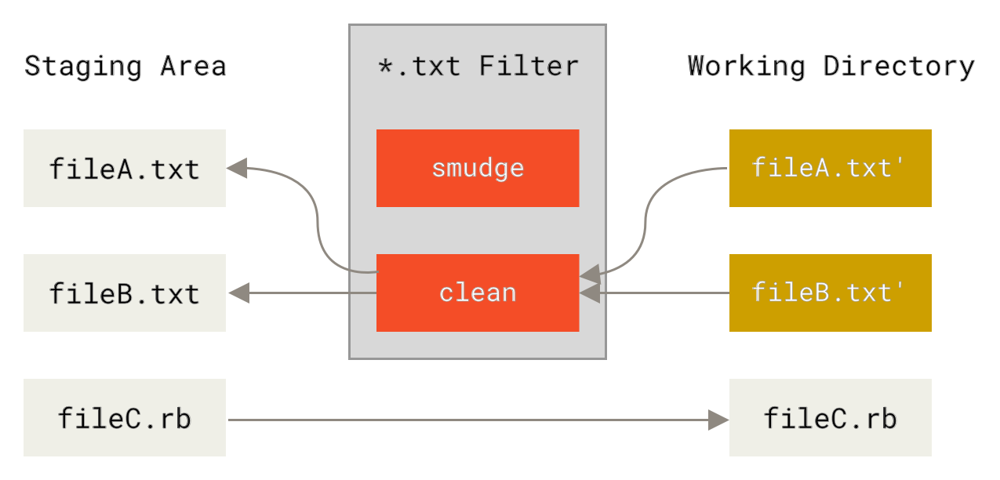

# Git 属性

你也可以针对特定的路径配置某些设置项，这样 Git 就只对特定的子目录或子文件集运用它们。
这些基于路径的设置项被称为 Git 属性，可以在你的目录下的 <code class="literal">.gitattributes</code> 文件内进行设置（通常是你的项目的根目录）。如果不想让这些属性文件与其它文件一同提交，你也可以在 <code class="literal">.git/info/attributes</code> 文件中进行设置。

通过使用属性，你可以对项目中的文件或目录单独定义不同的合并策略，让 Git 知道怎样比较非文本文件，或者让 Git 在提交或检出前过滤内容。
在本节，你将学习到一些能在自己的项目中用到的属性，并看到几个实际的例子。

## 二进制文件

你可以用 Git 属性让 Git 知道哪些是二进制文件（以防它没有识别出来），并指示其如何处理这些文件。
例如，一些文本文件是由机器产生的，没有办法进行比较，但是一些二进制文件可以比较。
你将了解到怎样让 Git 区分这些文件。

### 识别二进制文件

有些文件表面上是文本文件，实质上应被作为二进制文件处理。
例如，macOS 平台上的 Xcode 项目会包含一个以 <code class="literal">.pbxproj</code> 结尾的文件，
它通常是一个记录项目构建配置等信息的 JSON（纯文本 Javascript 数据类型）数据集，由 IDE 写入磁盘。
虽然技术上看它是由 UTF-8 编码的文本文件，但你并不会希望将它当作文本文件来处理，
因为它其实是一个轻量级数据库——如果有两个人修改了它，你通常无法合并内容，diff 的输出也帮不上什么忙。
它本应被机器处理。因此，你想把它当成二进制文件。

要让 Git 把所有 <code class="literal">pbxproj</code> 文件当成二进制文件，在 <code class="literal">.gitattributes</code> 文件中如下设置：

<pre class="source language-ini"><code>*.pbxproj binary</code></pre>

现在，Git 不会尝试转换或修正回车换行（CRLF）问题，当你在项目中运行 <code class="literal">git show</code> 或 <code class="literal">git diff</code> 时，Git 也不会比较或打印该文件的变化。

### 比较二进制文件

你也可以使用 Git 属性来有效地比较两个二进制文件。
秘诀在于，告诉 Git 怎么把你的二进制文件转化为文本格式，从而能够使用普通的 diff 方式进行对比。

首先，让我们尝试用这个技术解决世人最头疼的问题之一：对 Microsoft Word 文档进行版本控制。
大家都知道，Microsoft Word 几乎是世上最难缠的编辑器，尽管如此，大家还是在用它。
如果想对 Word 文档进行版本控制，你可以把文件加入到 Git 库中，每次修改后提交即可。但这样做有什么实际意义呢？
毕竟运行 <code class="literal">git diff</code> 命令后，你只能得到如下的结果：

<pre class="language-bash"><code>$ git diff
diff --git a/chapter1.docx b/chapter1.docx
index 88839c4..4afcb7c 100644
Binary files a/chapter1.docx and b/chapter1.docx differ</code></pre>

除了检出之后睁大眼睛逐行扫描，就真的没有办法直接比较两个不同版本的 Word 文档吗？
Git 属性能很好地解决此问题。
把下面这行文本加到你的 <code class="literal">.gitattributes</code> 文件中：

<pre class="source language-ini"><code>*.docx diff=word</code></pre>

这告诉 Git 当你尝试查看包含变更的比较结果时，所有匹配 <code class="literal">.docx</code> 模式的文件都应该使用“word”过滤器。
“word”过滤器是什么？
我们现在就来设置它。
我们会对 Git 进行配置，令其能够借助 <code class="literal">docx2txt</code> 程序将 Word 文档转为可读文本文件，这样不同的文件间就能够正确比较了。

首先，你需要安装 <code class="literal">docx2txt</code>；它可以从 <a href="https://sourceforge.net/projects/docx2txt" class="link">https://sourceforge.net/projects/docx2txt</a> 下载。
按照 <code class="literal">INSTALL</code> 文件的说明，把它放到你的可执行路径下。
接下来，你还需要写一个脚本把输出结果包装成 Git 支持的格式。
在你的可执行路径下创建一个叫 <code class="literal">docx2txt</code> 文件，添加这些内容：

<pre class="language-bash"><code>#!/bin/bash
docx2txt.pl &quot;$1&quot; -</code></pre>

别忘了用 <code class="literal">chmod a+x</code> 给这个文件加上可执行权限。
最后，你需要配置 Git 来使用这个脚本：

<pre class="language-bash"><code>$ git config diff.word.textconv docx2txt</code></pre>

现在如果在两个快照之间进行比较，Git 就会对那些以 <code class="literal">.docx</code> 结尾的文件应用“word”过滤器，即 <code class="literal">docx2txt</code>。
这样你的 Word 文件就能被高效地转换成文本文件并进行比较了。

作为例子，我把本书的第一章另存为 Word 文件，并提交到 Git 版本库。
接着，往其中加入一个新的段落。
运行 <code class="literal">git diff</code>，输出如下：

<pre class="language-bash"><code>$ git diff
diff --git a/chapter1.docx b/chapter1.docx
index 0b013ca..ba25db5 100644
--- a/chapter1.docx
+++ b/chapter1.docx
@@ -2,6 +2,7 @@
 This chapter will be about getting started with Git. We will begin at the beginning by explaining some background on version control tools, then move on to how to get Git running on your system and finally how to get it setup to start working with. At the end of this chapter you should understand why Git is around, why you should use it and you should be all setup to do so.
 1.1. About Version Control
 What is &quot;version control&quot;, and why should you care? Version control is a system that records changes to a file or set of files over time so that you can recall specific versions later. For the examples in this book you will use software source code as the files being version controlled, though in reality you can do this with nearly any type of file on a computer.
+Testing: 1, 2, 3.
 If you are a graphic or web designer and want to keep every version of an image or layout (which you would most certainly want to), a Version Control System (VCS) is a very wise thing to use. It allows you to revert files back to a previous state, revert the entire project back to a previous state, compare changes over time, see who last modified something that might be causing a problem, who introduced an issue and when, and more. Using a VCS also generally means that if you screw things up or lose files, you can easily recover. In addition, you get all this for very little overhead.
 1.1.1. Local Version Control Systems
 Many people&#39;s version-control method of choice is to copy files into another directory (perhaps a time-stamped directory, if they&#39;re clever). This approach is very common because it is so simple, but it is also incredibly error prone. It is easy to forget which directory you&#39;re in and accidentally write to the wrong file or copy over files you don&#39;t mean to.</code></pre>

Git 成功地挑出了我们添加的那句话“Testing: 1, 2, 3.”，一字不差。
还算不上完美——格式上的变动显示不出来——但已经足够了。

你还能用这个方法比较图像文件。
其中一个办法是，在比较时对图像文件运用一个过滤器，提炼出 EXIF 信息——这是在大部分图像格式中都有记录的一种元数据。
如果你下载并安装了 <code class="literal">exiftool</code> 程序，可以利用它将图像转换为关于元数据的文本信息，这样比较时至少能以文本的形式显示发生过的变动：
将以下内容放到你的 <code class="literal">.gitattributes</code> 文件中：

<pre class="source language-ini"><code>*.png diff=exif</code></pre>

配置 Git 以使用此工具：

<pre class="language-bash"><code>$ git config diff.exif.textconv exiftool</code></pre>

如果在项目中替换了一个图像文件，运行 <code class="literal">git diff</code> 命令的结果如下：

<pre class="source language-diff"><code>diff --git a/image.png b/image.png
index 88839c4..4afcb7c 100644
--- a/image.png
+++ b/image.png
@@ -1,12 +1,12 @@
 ExifTool Version Number         : 7.74
-File Size                       : 70 kB
-File Modification Date/Time     : 2009:04:21 07:02:45-07:00
+File Size                       : 94 kB
+File Modification Date/Time     : 2009:04:21 07:02:43-07:00
 File Type                       : PNG
 MIME Type                       : image/png
-Image Width                     : 1058
-Image Height                    : 889
+Image Width                     : 1056
+Image Height                    : 827
 Bit Depth                       : 8
 Color Type                      : RGB with Alpha</code></pre>

你一眼就能看出文件大小和图像尺寸发生了变化。

## 关键字展开

SVN 或 CVS 风格的关键字展开（keyword expansion）功能经常会被习惯于上述系统的开发者使用到。
在 Git 中，这项功能有一个主要问题，就是你无法利用它往文件中加入其关联提交的相关信息，因为 Git 总是先对文件做校验和运算（译者注：Git 中提交对象的校验依赖于文件的校验和，而 Git 属性针对特定文件或路径，因此基于 Git 属性的关键字展开无法仅根据文件反推出对应的提交）。
不过，我们可以在检出某个文件后对其注入文本，并在再次提交前删除这些文本。
Git 属性提供了两种方法来达到这一目的。

一种方法是，你可以把文件所对应数据对象的 SHA-1 校验和自动注入到文件中的 <code class="literal">$Id$</code> 字段。
如果在一个或多个文件上设置了该属性，下次当你检出相关分支的时候，Git 会用相应数据对象的 SHA-1 值替换上述字段。
注意，这不是提交对象的 SHA-1 校验和，而是数据对象本身的校验和。
将以下内容放到你的 <code class="literal">.gitattributes</code> 文件中：

<pre class="source language-ini"><code>*.txt ident</code></pre>

在一个测试文件中添加一个 <code class="literal">$Id$</code> 引用：

<pre class="language-bash"><code>$ echo &#39;$Id$&#39; &gt; test.txt</code></pre>

当你下次检出文件时，Git 将注入数据对象的 SHA-1 校验和：

<pre class="language-bash"><code>$ rm test.txt
$ git checkout -- test.txt
$ cat test.txt
$Id: 42812b7653c7b88933f8a9d6cad0ca16714b9bb3 $</code></pre>

然而，这个结果的用途比较有限。
如果用过 CVS 或 Subversion 的关键字替换功能，我们会想加上一个时间戳信息——光有 SHA-1 校验和用途不大，
它仅仅是个随机字符串，你无法凭字面值来区分不同 SHA-1 时间上的先后。

因此 Git 属性提供了另一种方法：我们可以编写自己的过滤器来实现文件提交或检出时的关键字替换。
一个过滤器由“clean”和“smudge”两个子过滤器组成。
在 <code class="literal">.gitattributes</code> 文件中，你能对特定的路径设置一个过滤器，然后设置文件检出前的处理脚本（“smudge”，见 <a id="xref-filters_a" href="#filters_a" class="xref">“smudge”过滤器会在文件被检出时触发</a>）和文件暂存前的处理脚本（“clean”，见 <a id="xref-filters_b" href="#filters_b" class="xref">“clean”过滤器会在文件被暂存时触发</a>）。
这两个过滤器能够被用来做各种有趣的事。

<figure id="filters_a" class="image">

<figcaption>Figure 2. “smudge”过滤器会在文件被检出时触发</figcaption>
</figure>
<figure id="filters_b" class="image">

<figcaption>Figure 3. “clean”过滤器会在文件被暂存时触发</figcaption>
</figure>

在（Git 源码中）实现这个特性的原始提交信息里给出了一个简单的例子：在提交前，用 <code class="literal">indent</code> 程序过滤所有 C 源码。
你可以在 <code class="literal">.gitattributes</code> 文件中对 filter 属性设置“indent”过滤器来过滤 <code class="literal">*.c</code> 文件

<pre class="source language-ini"><code>*.c filter=indent</code></pre>

然后，通过以下配置，让 Git 知道“indent”过滤器在 smudge 和 clean 时分别该做什么：

<pre class="language-bash"><code>$ git config --global filter.indent.clean indent
$ git config --global filter.indent.smudge cat</code></pre>

在这个例子中，当你暂存 <code class="literal">*.c</code> 文件时，<code class="literal">indent</code> 程序会先被触发；在把它们检出回硬盘时，<code class="literal">cat</code> 程序会先被触发。
<code class="literal">cat</code> 在这里没什么实际作用：它仅仅把输入的数据重新输出。
这样的组合可以有效地在暂存前用 <code class="literal">indent</code> 过滤所有的 C 源码。

另一个有趣的例子是实现 RCS 风格的 <code class="literal">$Date$</code> 关键字展开。
要想演示这个例子，我们需要实现这样的一个小脚本：接受文件名参数，得到项目的最新提交日期，并把日期写入该文件。
下面是一个实现了该功能的 Ruby 小脚本：

<pre class="source language-ruby"><code>#! /usr/bin/env ruby
data = STDIN.read
last_date = `git log --pretty=format:&quot;%ad&quot; -1`
puts data.gsub(&#39;$Date$&#39;, &#39;$Date: &#39; + last_date.to_s + &#39;$&#39;)</code></pre>

这个脚本从 <code class="literal">git log</code> 中得到最新提交日期，将其注入所有输入文件的 <code class="literal">$Date$</code> 字段，并输出结果——你可以使用最顺手的语言轻松实现一个类似的脚本。
把该脚本命名为 <code class="literal">expand_date</code>，放到你的可执行路径中。
现在，你需要在 Git 中设置一个过滤器（就叫它 <code class="literal">dater</code> 吧），让它在检出文件时调用你的 <code class="literal">expand_date</code> 来注入时间戳，完成 smudge 操作。
暂存文件时的 clean 操作则是用一行 Perl 表达式清除注入的内容：

<pre class="language-bash"><code>$ git config filter.dater.smudge expand_date
$ git config filter.dater.clean &#39;perl -pe &quot;s/\\\$Date[^\\\$]*\\\$/\\\$Date\\\$/&quot;&#39;</code></pre>

这段 Perl 代码会删除 <code class="literal">$Date$</code> 后面注入的内容，恢复它的原貌。
过滤器终于准备完成了，是时候测试一下。创建一个带有 <code class="literal">$Date$</code> 关键字的文件，
然后给它设置一个 Git 属性，关联我们的新过滤器：

<pre class="source language-ini"><code>date*.txt filter=dater</code></pre>

<pre class="language-bash"><code>$ echo &#39;# $Date$&#39; &gt; date_test.txt</code></pre>

提交该文件，并再次检出，你会发现关键字如期被替换了：

<pre class="language-bash"><code>$ git add date_test.txt .gitattributes
$ git commit -m &quot;Testing date expansion in Git&quot;
$ rm date_test.txt
$ git checkout date_test.txt
$ cat date_test.txt
# $Date: Tue Apr 21 07:26:52 2009 -0700$</code></pre>

自定义过滤器真的很强大。
不过你需要注意的是，因为 <code class="literal">.gitattributes</code> 文件会随着项目一起提交，而过滤器（例如这里的 <code class="literal">dater</code>）不会，所以过滤器有可能会失效。
当你在设计这些过滤器时，要注重容错性——它们在出错时应该能优雅地退出，从而不至于影响项目的正常运行。

## 导出版本库

Git 属性在导出项目归档（archive）时也能发挥作用。

### export-ignore</code>

当归档的时候，可以设置 Git 不导出某些文件和目录。
如果你不想在归档中包含某个子目录或文件，但想把它们纳入项目的版本管理中，你可以在 <code class="literal">export-ignore</code> 属性中指定它们。

例如，假设你在 <code class="literal">test/</code> 子目录下有一些测试文件，不希望它们被包含在项目导出的压缩包（tarball）中。
你可以增加下面这行到 Git 属性文件中：

<pre class="source language-ini"><code>test/ export-ignore</code></pre>

现在，当你运行 <code class="literal">git archive</code> 来创建项目的压缩包时，那个目录不会被包括在归档中。

### export-subst</code>

在导出文件进行部署的时候，你可以将 <code class="literal">git log</code> 的格式化和关键字展开处理应用到标记了
<code class="literal">export-subst</code> 属性的部分文件。

举个例子，如果你想在项目中包含一个叫做 <code class="literal">LAST_COMMIT</code> 的文件，
并在运行 <code class="literal">git archive</code> 的时候自动向它注入最新提交的元数据，可以像这样设置
<code class="literal">.gitattributes</code> 和 <code class="literal">LAST_COMMIT</code> 该文件：

<pre class="source language-ini"><code>LAST_COMMIT export-subst</code></pre>

<pre class="language-bash"><code>$ echo &#39;Last commit date: $Format:%cd by %aN$&#39; &gt; LAST_COMMIT
$ git add LAST_COMMIT .gitattributes
$ git commit -am &#39;adding LAST_COMMIT file for archives&#39;</code></pre>

运行 <code class="literal">git archive</code> 之后，归档文件的内容会被替换成这样：

<pre class="language-bash"><code>$ git archive HEAD | tar xCf ../deployment-testing -
$ cat ../deployment-testing/LAST_COMMIT
Last commit date: Tue Apr 21 08:38:48 2009 -0700 by Scott Chacon</code></pre>

你也可以用诸如提交信息或者任意的 <code class="literal">git notes</code> 进行替换，并且 <code class="literal">git log</code> 还能做简单的字词折行：

<pre class="language-bash"><code>$ echo &#39;$Format:Last commit: %h by %aN at %cd%n%+w(76,6,9)%B$&#39; &gt; LAST_COMMIT
$ git commit -am &#39;export-subst uses git log&#39;\&#39;&#39;s custom formatter

git archive 直接使用 git log 的 `pretty=format:`
处理器，并在输出中移除两侧的 `$Format:` 和 `$`
标记。
&#39;
$ git archive @ | tar xfO - LAST_COMMIT
Last commit: 312ccc8 by Jim Hill at Fri May 8 09:14:04 2015 -0700
       export-subst uses git log&#39;s custom formatter

         git archive uses git log&#39;s `pretty=format:` processor directly, and
         strips the surrounding `$Format:` and `$` markup from the output.</code></pre>

由此得到的归档适用于（当前的）部署工作。然而和其他的导出归档一样，它并不适用于后继的部署工作。

## 合并策略

通过 Git 属性，你还能对项目中的特定文件指定不同的合并策略。
一个非常有用的选项就是，告诉 Git 当特定文件发生冲突时不要尝试合并它们，而是直接使用你这边的内容。

考虑如下场景：项目中有一个分叉的或者定制过的主题分支，你希望该分支上的更改能合并回你的主干分支，同时需要忽略其中某些文件。此时这个合并策略就能派上用场。
假设你有一个数据库设置文件 <code class="literal">database.xml</code>，在两个分支中它是不同的，而你想合并另一个分支到你的分支上，又不想弄乱该数据库文件。
你可以设置属性如下：

<pre class="source language-ini"><code>database.xml merge=ours</code></pre>

然后定义一个虚拟的合并策略，叫做 <code class="literal">ours</code>：

<pre class="language-bash"><code>$ git config --global merge.ours.driver true</code></pre>

如果你合并了另一个分支，<code class="literal">database.xml</code> 文件不会有合并冲突，相反会显示如下信息：

<pre class="language-bash"><code>$ git merge topic
Auto-merging database.xml
Merge made by recursive.</code></pre>

这里，<code class="literal">database.xml</code> 保持了主干分支中的原始版本。

